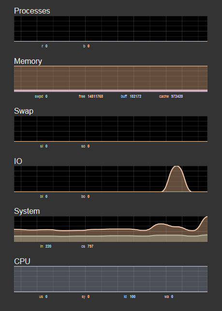

Websocketd/vmstats with Nginx Proxy
===================================

**`Websocketd`_*  is the WebSocket daemon written in Go Lang 

- `Websocketd`_
- `Web-vmstats`_
- `Docker`_
- `Ubuntu`_

Use this repository for testing quickly

Based on `Docker`_ 1.4.1 with `Ubuntu`_ 14.04 and latest `Websocketd`_

Screenshots
-----------

|vmstat| 

Docker Build
------------

::

    git clone https://github.com/srault95/docker-websocketd.git
    
    cd docker-websocketd
    
    docker build -t srault95/websocketd .
    
Docker Run
----------

::

   docker run -d --name mysocket -p 8089:80 srault95/websocketd
   
   # default user/password: root/root
   
   http://YOUR_PUBLIC_IP:8089
   
Change User/Password
--------------------

::

   docker run -d --name mysocket -p 8089:80 -e DEFAULT_USER=myuser -e DEFAULT_PASSWORD=password srault95/websocketd

Links
-----

- `Websocketd`_
- `Web-vmstats`_
- `Docker`_
- `Ubuntu`_

.. _`Docker`: https://www.docker.com/
.. _`Ubuntu`: http://www.ubuntu.com/
.. _`Web-vmstats`: https://github.com/joewalnes/web-vmstats
.. _`Websocketd`: http://websocketd.com/

   